# Discrete Deep Reinforcemente Learning for Mapless Navigation

## Introduction

Mapless Navigation is a key challenge in mobile robotics.  
In this project we focus our attention on navigation in narrow spaces.  
Specifically we invegaste whether an agent is able to navigate in a room with narrow corridors, like Maze could be. 
Thus we created an environment in Unity, and trained an agent using Double Deep Q-Learning. 
Then we compared the result with the ROS navigation stack, which first requires the map creation using SLAM. 
We discovered that an agent trained with DDQN is able to navigate in narrow spaces better than the ROS navigation stack in terms of best path, and time to navigate to the goal.  
However in some cases the AI agent was not able to get to the goal. This behaviour never occured with ROS. 
We believe that training the agent for more epoches could improve the navigation. 

## Unity environment 
We created a Maze in unity, to train our turtlebot. 
Figure 1 shows the Unity enviroment. 
The pink cube represents the location the turtlebot should navigate to. 

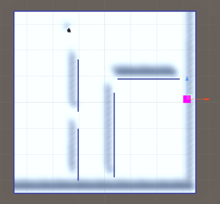

## Training and testing. 

We tried two different approaches. 
Firsty, we tried to train a network with a fixed goal in a specific position. This enviroment is present in Figure 2. 
The agent was able to navigate optimally, thus,  following the best path to go to the goal. 
On our testing we tried to move the goal in a different position than training. 
The agent was able to navigate to the goal only if the goal's position *was not* behind a wall. Figure 3 represents an enviroment where the robot was able to navigate. 
If the goal was beyond a wall, the robot could not navigate to the goal as it hitted the wall. 
This shows how the agent learned that it's job was navigating to the goal following the shortest path, but it did not learn how to overcome the wall, except for the case that he had been trained.  
Therefore we trained the network using another approach. In our second experiment, the goal could be positoned in 5 different locations, Figure 4. 
We chose those places on purpose. The agent must not overfit the learning with navigating towards the goal only in one case. Presenting the agent multiple scenarios, should improve the learning to approach different situations. 

| 
Figure 2
                                                   |                                      
Figure 3
                                       |                                                                                 
Figure 4
 |
| -------------------------------------------------------------------------------- | :-------------------------------------------------------------------------------------------------------: | -------------------------------------------------------------------------------------------------------------: |
| 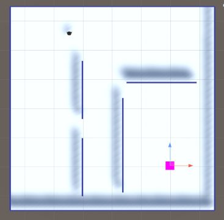 | 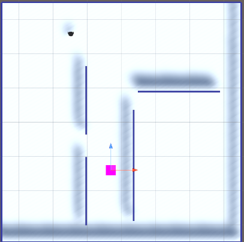 | 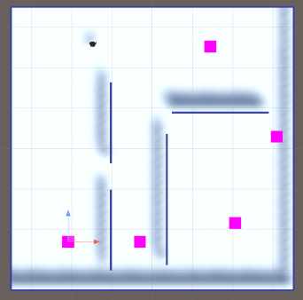 |

## Results 

Figure 5 shows the avarage reward of DDQN algorithm when the goal is fixed.  
Figure 6 shows the avarage reward of DDQN algorithm when the goal is random between 5 different positions.  
Figure 7 shows the avarage reward of DDQN algorithm. The goal is fixed till step 90k. The goal is then moved to another location, to check whether the agent is able to adapt the behaviour learnt till then and move to another location.  
  
Figure 5 and 6, clearly shows how the robot is able to learn how to reach the goal even when the goal position changes.  
Instead, Figure 7 shows how the agent overfitted during the first 90k steps, as it was not able to reach the goal when its position had changed. 

| 
Figure 5
                                              |                       
Figure 6
                        |                                              
Figure 7
 |
| --------------------------------------------------------------------------- | :-------------------------------------------------------------------------: | --------------------------------------------------------------------------: |
| 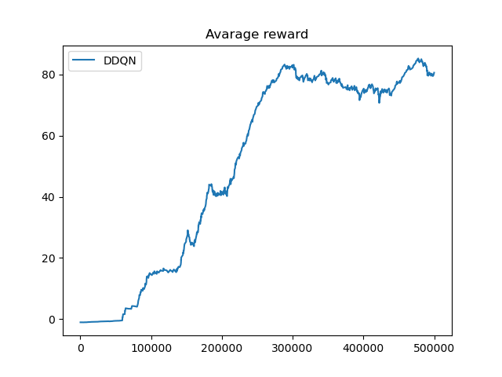 | 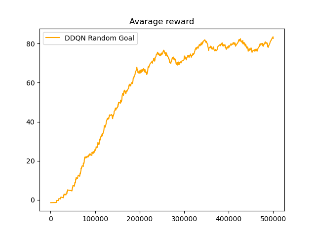 | 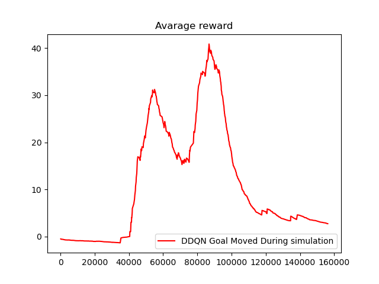 |

## Gazebo environment 

We created the Maze environment in gazebo.
Figure 8 shows the envinroment.
In order to test the navigation using the turtlebot navigation stack, a SLAM process is required first.
Therefore, first, we  built the map using gmapping SLAM, and the teleoperation package to move the turtlebot in the environment.
Secondly, in order to use the navigation, the navigation package, which uses RVIz has been started.
An inital estimation of where the turtlebot is, is required.
Then, the goal can be set and the navigation stack find the best path to the goal, using  two planner, a local planner used to avoid obstacles, and a global planner used to calculate the best path. 
Figure 9 shows the best path.

| 
Figure 8
                                                                            |                                                   
Figure 9
                                                    |
| --------------------------------------------------------------------------------------------------------- | :---------------------------------------------------------------------------------------------------------------------------------: |
| 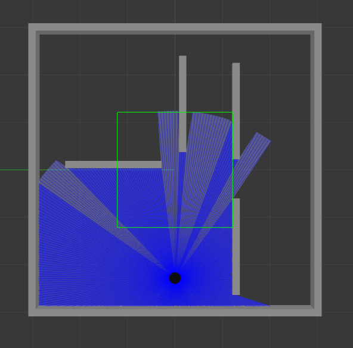 | 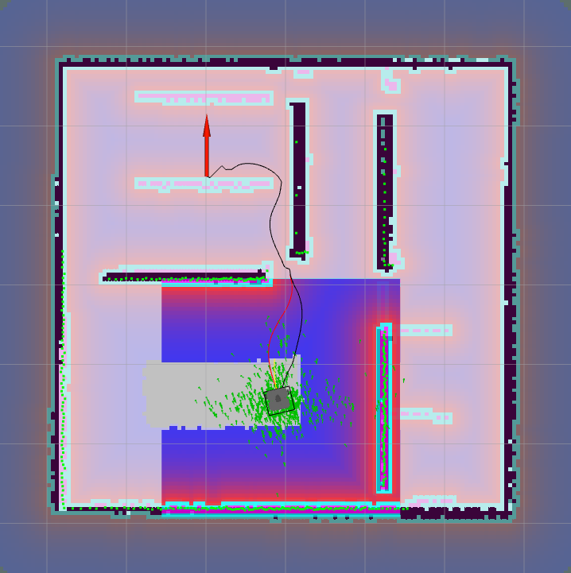 |

## Navigation stack result 

In some cases, the navigation stack fails to go to the goal on first trial. 
Infact the navigation stack is not confident in passing through narrow spaces as the AI agent is. 
The navigation stack infact, tends to prefer a worst path in terms of legth to avoid turning too close to the wall and passing in narrow passages.  
In Video 1, we present a simulation of the turtlebot guided by the navigation stack, which fails to reach the goal on first try, so he overcome the obstacle by following the wall to the other edge, and pass trough the other narrow passage. 
In our tests, we found out that the navigation stack always reach the goal, even though not in the optimal way.  
On the other hand, the AI agent in one case, fails to navigate to the goal, hitting the wall.
In video 2, we present a simulation where the AI agent fails to navigate to the goal, because it hits the wall. 

| 
Video 1
                                            | 
Video 2
 |
| ------------------------------------------------------------------------ | :---------------------------: |
| <video width="300" alt="There is a line tracking the path of the robot"> |
<source src="video/gazebo.mp4" type="video/mp4" />
</video>
    |

| <video width="300" alt="There is a line tracking the path of the robot"> <source src="video/unity.mp4" type="video/mp4" /></video> |

## Discrete Proximal Policy Optimization

Our last test, was to verify whether an AI agent trained using a discrete version of Proximal Policy Optimization could be better than DDQN. 
The agent has been trained in the enviroment represented in Figure 4, where the goal's position is set randomly between five positions, as represented in Figure 4. 
Figure 12 show the avarage reward of PPO algorithm. 
Figure 13 represents a comparison between the avarage reward, of the agent trained with PPO and the agent trained with DDQN. 
It is clear how PPO is a step behind DDQN. Infact the evaluation shows that it is not able to navigate as well as the DDQN agent. 

| 
Figure 12
                                                                                     |                                                  
Figure 13
                                                  |
| ------------------------------------------------------------------------------------------------------------------- | :-------------------------------------------------------------------------------------------------------------------------------: |
| 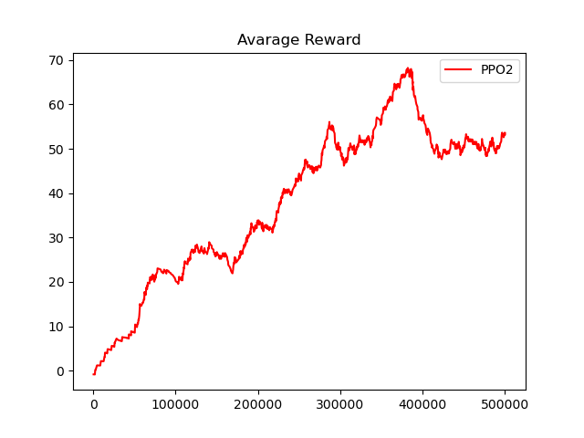 | 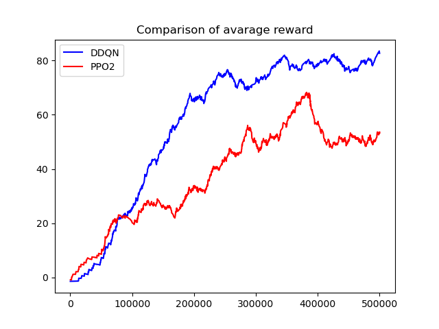 |

We investigated further, trying to train the network for 1M steps using the model saved while training PPO for 500k steps. 
Figure 14 shows that the reward increases, with respect to the agent trained with PPO2 for 500k steps. 
However, the agent is still not able to perform well navigating narrow passages. 

| 
Figure 14
                                                                 |
| ----------------------------------------------------------------------------------------------- |
|  |
